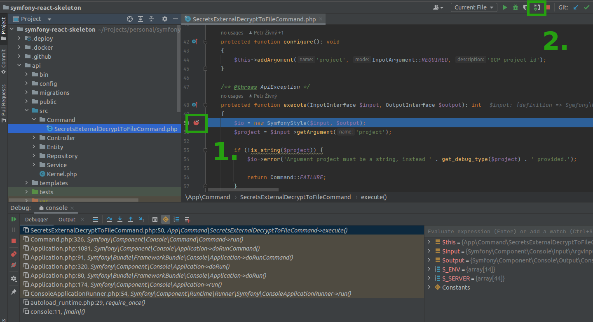

## How setup and use Xdebug
Xdebug is configured out-of-the-box in container for all CLI commands. Try it:
### CLI usage
To use xdebug in CLI, you need to use `xphp` alias inside docker container. Eg.:
1. Open api/src/Command/SecretsExternalDecryptToFileCommand.php in PhpStorm (or other IDE) and place a xdebug breakpoint on the first line of execute method.
2. Check if Listening for PHP Debug Connections icon is in listening mode. 
3. `docker exec -it symfony-react-skeleton_php sh -l`
4. `xphp bin/console secrets:external:decrypt-to-file foo`
5. If asked by PhpStorm to provide server mappings, do it like this 
6. Debugger should stop at your breakpoint, and you should see all debug info.

### BROWSER usage
I recommend to install [Xdebug helper](https://chrome.google.com/webstore/detail/xdebug-helper/eadndfjplgieldjbigjakmdgkmoaaaoc), or other similar tool to add XDEBUG_SESSION cookie to requests.
1. Open api/src/Controller/HealthController.php in PhpStorm (or other IDE) and place a xdebug breakpoint on the first line of index method.
2. Check if Listening for PHP Debug Connections icon is in listening mode.
3. Perform http://localhost:81/health request from your browser (with a XDEBUG_SESSION cookie, see description few lines before)
4. If asked by PhpStorm to provide server mappings, do it like this 
5. Debugger should stop at your breakpoint, and you should see all debug info.
